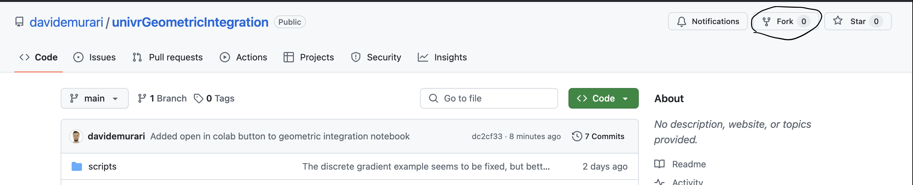

## Repository for the seminar course "Geometric methods for differential equations and learning applications"

- More details about the lecture notes can be found here: [Lecture Notes](https://davidemurari.com/teaching/)
- Details about the course are here: [UniVR web page](https://www.di.univr.it/?ent=seminario&id=6405)

To access the code examples you can proceed in one of the three following options:
- If you are (a bit) experienced with GitHub you can Fork the repository and then work on it locally

- If you have never worked with GitHub but are already setup to work with Python scripts and notebooks on your computer, you can download the repository as a .zip folder and work on your computer.

- If you do not have the computer setup to work with Python scripts and notebooks, you can open the notebooks from this page, and click on the button  appearing on each of them. You will then access Google Colab which allows to run the code without having to do anything locally. 
